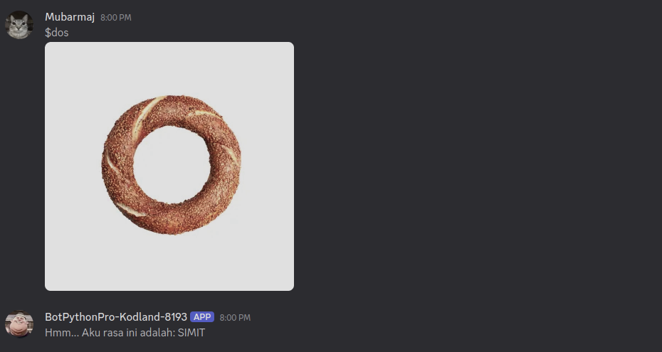

# Dos or Not Dos - Discord Image Classifier Bot

Bot Discord sederhana untuk mengklasifikasikan gambar makanan menjadi **DONUT** atau **SIMIT** menggunakan model Keras (`.h5`).

## Tentang Proyek
Proyek ini menggabungkan:
- **Discord Bot** untuk menerima gambar dari user
- **Model Machine Learning (Keras)** untuk melakukan prediksi
- **Folder upload lokal** sebagai tempat penyimpanan gambar sementara

Saat user mengirim gambar lewat command tertentu, bot akan menyimpan gambar ke folder `uploads/`, lalu memprosesnya menggunakan model di `model/keras_model.h5`.

## Fitur Utama
- Command bot dasar (`$hello`, `$heh`)
- Menyimpan gambar yang di-attach user ke folder `uploads/`
- Klasifikasi gambar via command `$dos`
- Jika confidence rendah (`< 0.5`), bot akan mengembalikan `FAILED_TO_DETECT`

## Kelas yang Didukung
Berdasarkan file `model/labels.txt`, model mengenali:
- `DONUT`
- `SIMIT`

## Struktur Proyek
```text
.
├── bot.py              # Bot utama + command klasifikasi
├── main.py             # Versi bot dasar (tanpa ML)
├── modelpy.py          # Loader model + fungsi prediksi guess(...)
├── model/
│   ├── keras_model.h5
│   ├── labels.txt
│   └── converted_keras.zip
├── uploads/            # Tempat simpan file gambar dari Discord
├── img/                # Dataset/contoh gambar
└── Pipfile
```

## Cara Menjalankan

### 1. Siapkan environment
Gunakan Python **3.12** (sesuai `Pipfile`).

```bash
python -m venv .venv
source .venv/bin/activate
pip install -U pip
pip install discord.py tensorflow pillow numpy
```

### 2. Siapkan Discord Bot Token
Di `bot.py`, ganti:
```python
bot.run("HERE GOES YOUR TOKEN")
```
dengan token bot kamu.

Saran keamanan: gunakan environment variable, jangan hardcode token di source code.

### 3. Jalankan bot
```bash
python bot.py
```

Jika sukses, terminal akan menampilkan:
```text
We have logged in as <nama_bot>
```

## Daftar Command
- `$hello` -> sapaan dari bot
- `$heh [angka]` -> mengirim teks "he" berulang
- `$check` -> menyimpan attachment ke folder `uploads/`
- `$dos` -> klasifikasi gambar attachment menjadi `DONUT` / `SIMIT`



## Contoh Alur Pakai
1. Ketik `$dos` sambil attach gambar
2. Bot menyimpan file ke `uploads/`
3. Bot memanggil `modelpy.guess(...)`
4. Bot mengirim hasil prediksi ke channel

## Catatan Teknis
- Preprocessing gambar menggunakan resize + crop ke `224x224`
- Normalisasi piksel: `(x / 127.5) - 1`
- Threshold confidence saat ini: `0.5`

## Rencana Pengembangan
- Pindahkan token ke `.env`
- Tambahkan logging error saat gambar tidak valid
- Tambahkan command untuk menampilkan confidence score
- Tambahkan lebih banyak kelas dan retrain model

## Lisensi
Proyek ini menggunakan lisensi kustom: `Custom Non-Commercial & Ethical Use License (CNEUL) v1.0`.

Ringkasannya:
- Tidak boleh digunakan untuk hal berbahaya atau melanggar hukum
- Tidak boleh dijual atau digunakan untuk tujuan komersial tanpa izin tertulis
- Jika didistribusikan ulang, wajib mencantumkan atribusi dan menyertakan lisensi

Detail lengkap ada di file `LICENSE`.

---

Kalau kamu mau, README ini juga bisa saya upgrade lagi jadi versi **portfolio-ready** (dengan badge, arsitektur, dan screenshot hasil bot di Discord).
